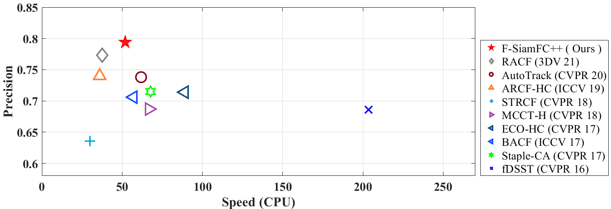
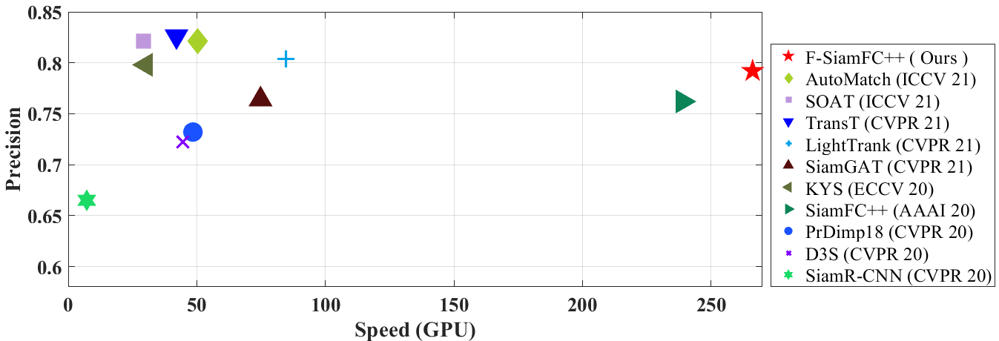

# F-SiamFCpp

This is the official code for the paper "Fisher Pruning for Real-Time UAV Tracking" accepted at  IJCNN2022.


F-SiamFC++ tracker which demonstrates a excellent balance between efficiency and precision.Extensive
experiments on four UAV benchmarks, including UAV123@10fps,DTB70, UAVDT and Vistrone2018 (VisDrone2018-test-dev), show that the proposed F-SiamFC++ tracker achieves state-of-the-art performance.

[Fisher Pruning for Real-Time UAV Tracking | IEEE Conference Publication | IEEE Xplore](https://ieeexplore.ieee.org/document/9892373)

## Precision VS Speed

We compared the precision and speed of F-SiamFC++ tracker and the state-of-the-art DCF-based tracker on the UAVDT dataset, using a single CPU.



We compared the precision and speed of F-SiamFC++ tracker and the state-of-the-art DL-based tracker on the UAVDT dataset, using a single GPU.



## Test

```
cd  /home/xxx/xxx/F-SiamFCpp-master 
python ./bin/my_test.py
```
## Train
```
cd  /home/xxx/xxx/F-SiamFCpp-master
python ./bin/my_train.py
```

##  Experiment
- GPU NVIDIA TitanX  8G  
- CPU Intel  i9-10850K (3.6GHz) 16GB RAM
- CUDA 10.2
- ubuntu 18.04 
- pytorch 1.10.0
- torchvision 0.11.1
- python 3.7.3

## Citation

If you find this work or code is helpful, please consider citing our paper:

```
@INPROCEEDINGS{F_SiamFCpp_2022,

  author={Wu, Wanying and Zhong, Pengzhi and Li, Shuiwang},
  
  booktitle={2022 International Joint Conference on Neural Networks (IJCNN)}, 
  title={Fisher Pruning for Real-Time UAV Tracking}, 
  
  year={2022},
  
  volume={},
  
  number={},
  
  pages={1-7},
  
  doi={10.1109/IJCNN55064.2022.9892373}
  
  }
```

## Reference
[Megvii](https://github.com/MegviiDetection/video_analyst)

```
[1] Xu Y, Wang Z, Li Z, et al. SiamFC++: Towards Robust and Accurate Visual Tracking with Target Estimation Guidelines. arXiv preprint arXiv:1911.06188, 2019.
```
